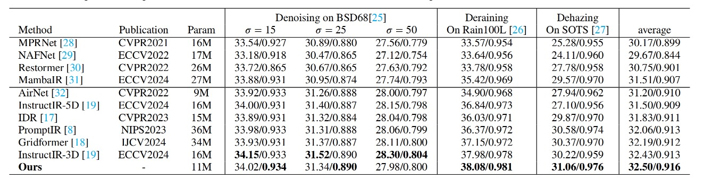

# Efficient All-in-One Image Restoration via Foundation-Model-Guided Dynamic Expert Kernels and Adaptive Spectral Masking

[Zhidong Zhu](https://scholar.google.com/citations?user=gMoJbSsAAAAJ&hl=zh-CN),
Bangshu Xiong, Shuzhen Yu, Jinhao Zhu,
[Zhibo Rao](https://scholar.google.com/citations?user=36YvjLAAAAAJ&hl=zh-CN),
Qiaofeng Ou, and
[Xing Li](https://scholar.google.com/citations?user=8IcXm6AAAAAJ&hl=zh-CN)

The paper is currently under review.

## Overview

This repository provides the implementation of **Expert-Restore**, an all-in-one image restoration framework for jointly handling multiple degradation types within a unified model.

The repository currently provides:

* Training and evaluation code
* Conda environment configuration
* Dataset preparation instructions
* Single-degradation and all-in-one evaluation protocols
* Pretrained model checkpoints
* Quantitative and visual restoration results

The supported restoration tasks are:

* Image denoising
* Image deraining
* Image dehazing
* Image deblurring
* Low-light image enhancement

## Repository Setup

Clone the repository:

```bash
git clone https://github.com/Archaic-Atom/Expert-Restore.git
cd Expert-Restore
```

## Environment Installation

The Conda environment used in our experiments can be recreated using the provided `env.yaml` file:

```bash
conda env create -f env.yaml
```

Activate the environment after installation:

```bash
conda activate <environment_name>
```

Please refer to the environment name specified in `env.yaml`.

## Dataset Download

All experiments are conducted using publicly available image restoration datasets.

### Image Denoising

Training datasets:

* [BSD400](https://drive.google.com/file/d/1idKFDkAHJGAFDn1OyXZxsTbOSBx9GS8N/view?usp=sharing)
* [Waterloo Exploration Database (WED)](https://drive.google.com/file/d/1e62XGdi5c6IbvkZ70LFq0KLRhFvih7US/view?usp=sharing)

Testing datasets:

* [BSD68](https://github.com/clausmichele/CBSD68-dataset/tree/master/CBSD68/original)
* [Urban100](https://drive.google.com/drive/folders/1B3DJGQKB6eNdwuQIhdskA64qUuVKLZ9u)
* [Kodak24](https://r0k.us/graphics/kodak/)

### Image Deraining

Training and testing datasets:

* [Train100L and Rain100L](https://drive.google.com/drive/folders/1-_Tw-LHJF4vh8fpogKgZx1EQ9MhsJI_f?usp=sharing)

### Image Dehazing

Training dataset:

* [RESIDE](https://sites.google.com/view/reside-dehaze-datasets/reside-%CE%B2)

Testing dataset:

* [SOTS-Outdoor](https://sites.google.com/view/reside-dehaze-datasets/reside-v0)

### Image Deblurring

Training and testing dataset:

* [GoPro](https://drive.google.com/file/d/1y_wQ5G5B65HS_mdIjxKYTcnRys_AGh5v/view?usp=sharing)

### Low-Light Image Enhancement

Training and testing dataset:

* [LOL-V1](https://daooshee.github.io/BMVC2018website/)

## Dataset Preparation

Place the training datasets in:

```text
data/Train/{task_name}/
```

where `{task_name}` is one of the following:

```text
Denoise
Derain
Dehaze
Deblur
Enhance
```

Place the testing datasets in the `test/` directory. Each restoration task should have a separate subdirectory.

A general directory organization is:

```text
data/
└── Train/
    ├── Denoise/
    ├── Derain/
    ├── Dehaze/
    ├── Deblur/
    └── Enhance/

test/
├── Denoise/
├── Derain/
├── Dehaze/
├── Deblur/
└── Enhance/
```

Further dataset preparation details are provided in:

```text
data_dir/DATA_README.md
```

## Training

After preparing the datasets, run:

```bash
python train.py
```

By default, the model is trained under the five-degradation all-in-one setting, including:

* Denoising
* Deraining
* Dehazing
* Deblurring
* Low-light enhancement

The `de_type` argument controls the degradation types included during training.

For example, to train a model only for deraining and dehazing, run:

```bash
python train.py --de_type derain dehaze
```

The available degradation types are:

```text
denoise
derain
dehaze
deblur
enhance
```

## Pretrained Models

The pretrained model checkpoints can be downloaded from:

[Download pretrained Expert-Restore models](https://drive.google.com/drive/folders/1_XX1kFSsnV6u9BfjysgR05cLKUiNKTyF)

After downloading, place the checkpoint files in:

```text
ckpt/
```

## Evaluation

After preparing the testing datasets and downloading the corresponding checkpoints, run:

```bash
python test.py --mode {n}
```

The `mode` argument determines the evaluation task or protocol.

| Mode | Evaluation setting                   |
| ---: | ------------------------------------ |
|  `0` | Image denoising                      |
|  `1` | Image deraining                      |
|  `2` | Image dehazing                       |
|  `3` | Image deblurring                     |
|  `4` | Low-light image enhancement          |
|  `5` | Three-degradation all-in-one setting |
|  `6` | Five-degradation all-in-one setting  |

The three-degradation setting includes:

```text
Denoising + Deraining + Dehazing
```

The five-degradation setting includes:

```text
Denoising + Deraining + Dehazing + Deblurring + Low-light Enhancement
```

For example, to evaluate the model under the five-degradation all-in-one setting, run:

```bash
python test.py --mode 6
```

## Experimental Protocols

### Single-Degradation Evaluation

Modes `0`--`4` evaluate Expert-Restore separately on individual restoration tasks.

### Three-Degradation All-in-One Evaluation

Mode `5` evaluates one unified model on:

* Image denoising
* Image deraining
* Image dehazing

### Five-Degradation All-in-One Evaluation

Mode `6` evaluates one unified model on:

* Image denoising
* Image deraining
* Image dehazing
* Image deblurring
* Low-light image enhancement

The same model checkpoint is used to process all degradation types included in the corresponding all-in-one setting.

## Results

Performance results of Expert-Restore trained under the three-degradation all-in-one setting are shown below.

<details>
<summary><strong>Three-Degradation All-in-One Results</strong></summary>

<br>



</details>

The restored visual results can be downloaded from:

[Download visual restoration results](https://drive.google.com/drive/folders/1OsaDzqrbED2SmZx_cr54xiByI_6sM0B_)

## Reproducibility Information

The following resources are provided for reproducing the reported experiments:

* Source code for model training and evaluation
* Conda environment configuration in `env.yaml`
* Public dataset download links
* Dataset organization instructions
* Training commands for selected degradation combinations
* Evaluation modes for single-task and all-in-one protocols
* Pretrained model checkpoints
* Visual restoration results

## Contact

For questions regarding the implementation or experiments, please contact:

```text
zhidongzhu@buaa.edu.cn
```

## Acknowledgment

This implementation is developed based on the following repository:

* [PromptIR](https://github.com/va1shn9v/PromptIR)
